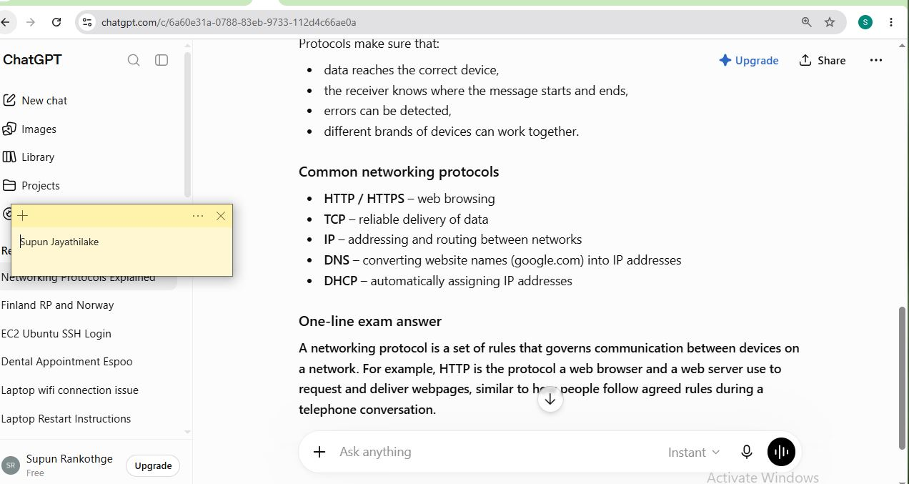

# Week 00 - Internet and Networking

Part of the DevOps Micro Internship (DMI) Cohort 3 with Agentic AI

---

# 🧑‍💻 Task 1: Using ChatGPT as Your Learning Assistant

## Scenario

You're new to DevOps and will frequently encounter technical questions. ChatGPT can be your learning companion.

## Your Task

Write a clear ChatGPT prompt to help you understand:

> "What is a protocol in networking? Explain with a simple real-life example."

Take a screenshot of your interaction showing:

* Your detailed prompt (with clear expectations)
* ChatGPT's simplified response with an example

## Screenshot

Save your screenshot in the `screenshots` folder and update the file name below.





Replace `task-1-chatgpt.png` with your actual screenshot file name.

---

## What I Learned (2–3 lines)

I learned that networking protocols are the rules that allow devices to communicate correctly and reliably. I also understood how protocols such as HTTP help browsers and web servers exchange information, similar to following rules in a real-life conversation.

---

# 🌐 Task 2: Internet and Networking

## Scenario

Your friend is launching an online bookstore named **EpicReads**.

He asked you to explain how users globally can access his website hosted in Finland.

## Your Task

Write a short explanation (**100–150 words**) that includes:

* Packet Switching
* IP Address
* TCP/IP
* HTTP/HTTPS

💡 **Tip:** You may use ChatGPT (as demonstrated in Task 1) to refine your explanation.

## Answer

When a user anywhere in the world visits EpicReads, their web browser sends a request to the website hosted in Finland using the HTTP or HTTPS protocol. HTTPS encrypts the communication to keep customer information secure. The request is broken into small pieces using packet switching, allowing the data to travel efficiently across different network paths. Each packet contains the IP address of both the user's device and the EpicReads server so routers know where to send it. The TCP/IP protocol suite manages the communication: IP handles addressing and routing, while TCP ensures all packets arrive correctly, in the right order, and without missing data. Once the server receives the request, it sends the webpage back to the user, who can then browse and purchase books from anywhere in the world.

---

# 🏗️ Task 3: Application Architecture & Stack

## Scenario

EpicReads bookstore has two application versions:

### Two-Tier Application

* Frontend
* Database

### Three-Tier Application

* Frontend
* Backend
* Database

## Your Task

* Draw simple diagrams (hand-drawn or tool-based such as draw.io)
* Label each layer clearly
* List at least two common technologies or tools used for each layer
* Submit a screenshot or photo clearly showing your own drawing

## Diagram Screenshot / Photo

Save your diagram image in the `screenshots` folder and update the file name below.


Replace `task-3-diagram.png` with your actual diagram file name.

---

## Technologies Used

### Frontend

* HTML, CSS, JavaScript
* React

### Backend

* Node.js
* Express.js

### Database

* MySQL
* MongoDB

---

# 🌍 Task 4: Domain Name & DNS (Basic Concepts)

## Scenario

Your friend's bookstore **EpicReads** is currently accessible through:

```text
52.172.142.222:3000
```

He purchased the domain:

```text
epicreads.com
```

## Your Task

In **50–100 words**, explain in your own words:

1. What is DNS (Domain Name System)?
2. Which DNS record type should be used to connect the domain to the given IP, and why?

## Answer

DNS (Domain Name System) is like the internet's phonebook. It translates easy-to-remember domain names, such as epicreads.com, into IP addresses that computers use to find websites. To connect epicreads.com to 52.172.142.222, an A (Address) record should be used because it maps a domain name directly to an IPv4 address. This allows users to access the bookstore by typing epicreads.com instead of remembering the numerical IP address.

---

# 💻 Task 5: Visual Studio Code Setup (Hands-on)

## Your Task

Install Visual Studio Code (if not already installed).

Take a screenshot of your VS Code environment showing:

* Terminal open inside VS Code
* Running a basic command:

### Windows

```powershell
dir
```

### Linux / macOS

```bash
pwd
ls
```

* Your selected VS Code theme clearly visible

⚠️ **Important:** The screenshot must show your username or another identifiable detail to confirm it is your environment.

## Screenshot

Save your screenshot in the `screenshots` folder and update the file name below.


Replace `task-5-vscode.png` with your actual screenshot file name.

---

# 🔗 Task 6: Publish Your Assignment as a LinkedIn Post

## Objective

Publishing on LinkedIn helps you:

* Build your professional online presence
* Reinforce your learning
* Document your DevOps journey publicly

## Your Task

Summarize your answers from Tasks 1–5 into a LinkedIn post.

Clearly structure your post into the following sections:

* ChatGPT
* Internet & Networking
* App Architecture
* DNS
* VS Code Setup

Add the following credit note at the end of your post:

> **P.S. This post is part of the DevOps Micro Internship (DMI) with Agentic AI — Cohort 3 — by Pravin Mishra. My graded progress is public: https://dmi.pravinmishra.com/s/YOUR-GITHUB-USERNAME.html · Start your DevOps journey: https://dmi.pravinmishra.com/?utm_source=student&utm_medium=ps-linkedin&utm_campaign=cohort3**

---

## LinkedIn Post URL

Paste your LinkedIn post URL here:

```text
https://www.linkedin.com/feed/update/urn:li:activity:7473968528786841600/
```

---

## LinkedIn Post Backup Copy

Paste the full text of your LinkedIn post here:

🚀 My DevOps Learning Journey – Tasks 1 to 5
As part of my DevOps Micro Internship, I completed several foundational tasks covering networking, system design, and development tools. Here’s a summary of what I learned:
🤖 ChatGPT
I learned how ChatGPT can explain technical concepts in a simple way, help with writing tasks, and support learning by breaking down complex topics like networking and system architecture into easy explanations.
🌐 Internet & Networking
I understood that the Internet works through protocols and packet switching. Data is broken into small packets, transmitted across networks, and reassembled at the destination using IP addresses and TCP/IP protocols. HTTP/HTTPS helps in loading web pages securely.
🏗️ App Architecture
I learned the difference between two-tier and three-tier architectures.
Two-tier: Frontend directly communicates with the database
Three-tier: Frontend → Backend → Database
 Three-tier architecture improves scalability, security, and maintainability.
🌍 DNS (Domain Name System)
DNS acts like the internet’s phonebook, converting domain names into IP addresses. To connect a domain to a server, an A record is used to map the domain to an IPv4 address.
💻 VS Code Setup
I learned how to use Visual Studio Code, open the integrated terminal, and run basic commands like dir, pwd, and ls. I also explored how to take screenshots of my environment for assignment submission.
📌 These tasks helped me understand the fundamentals of DevOps, networking, and development tools in a practical way.
P.S. This post is part of the DevOps Micro Internship with Agentic AI Cohort run by Pravin Mishra https://lnkd.in/dkPeb7Nm. Join the community here: https://lnkd.in/d3sQDC3J

---

# Reflection – Week 0

### What did you find easy?

I found it easy to understand the basic networking concepts such as protocols, DNS, IP addresses, and application architecture. Using VS Code and Git for simple tasks was also straightforward.

---

### What was difficult?

The most challenging part was understanding how all the networking components work together, especially packet switching and TCP/IP. Remembering different DNS record types also required extra practice.

---

### What will you improve next week?

Next week, I will spend more time practicing Git commands, networking concepts, and using VS Code efficiently. I also plan to complete more hands-on exercises to strengthen my understanding.

---

## 📌 About DMI & CloudAdvisory

DevOps Micro Internship (DMI) is a project-based DevOps program run by Pravin Mishra (The CloudAdvisory) focused on real-world execution, systems thinking, and career readiness.

It helps learners build strong DevOps foundations with hands-on experience.


## 📌 Resources

- 🌐 **DMI Official Website:** https://pravinmishra.com/dmi  
- 🎓 **DevOps for Beginners (Udemy):** https://www.udemy.com/course/devops-for-beginners-docker-k8s-cloud-cicd-4-projects/  
- 🎓 **Ultimate Agentic AI DevOps with Clude Code** https://www.udemy.com/course/ultimate-agentic-ai-devops-with-claude-code/?referralCode=448389767BC96284087B
- 🎓 **DevOps with Claude Code: Terraform, EKS, ArgoCD & Helm** https://www.udemy.com/course/devops-with-claude-code-terraform-eks-argocd-helm/?referralCode=1C5B734505D65A010FA3
- ▶️ **YouTube Playlist (DMI Cohort 3):** https://www.youtube.com/playlist?list=PLFeSNDtI4Cho  
- 🔗 **Pravin Mishra (LinkedIn):** https://www.linkedin.com/in/pravin-mishra-aws-trainer/  
- 🏢 **CloudAdvisory (LinkedIn):** https://www.linkedin.com/company/thecloudadvisory/

---

*This submission is part of DevOps Micro Internship (DMI) Cohort 3 — Agentic AI Track*