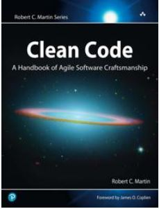
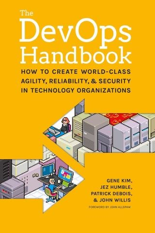
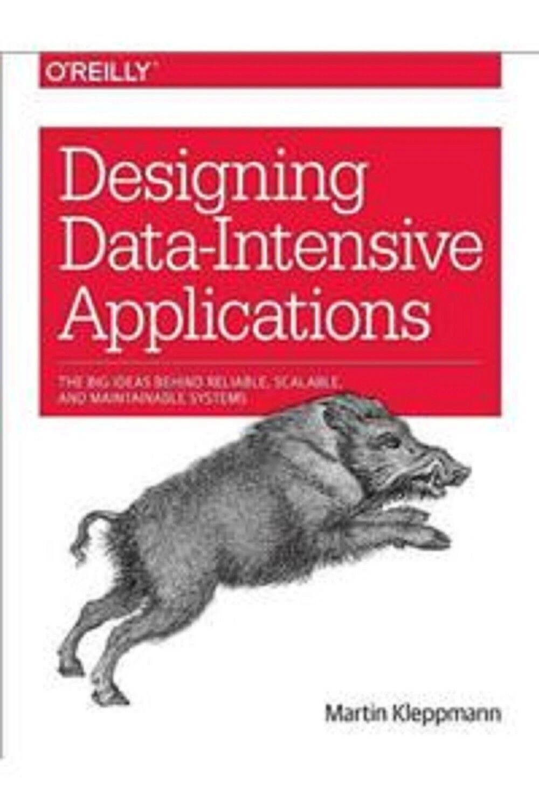
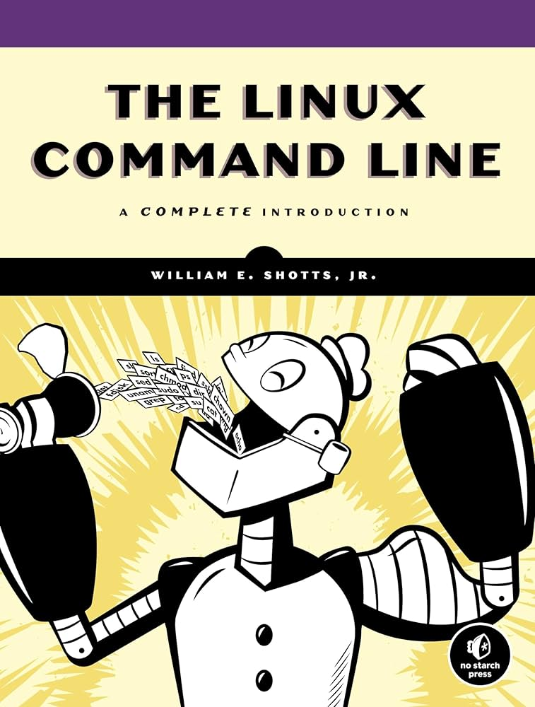
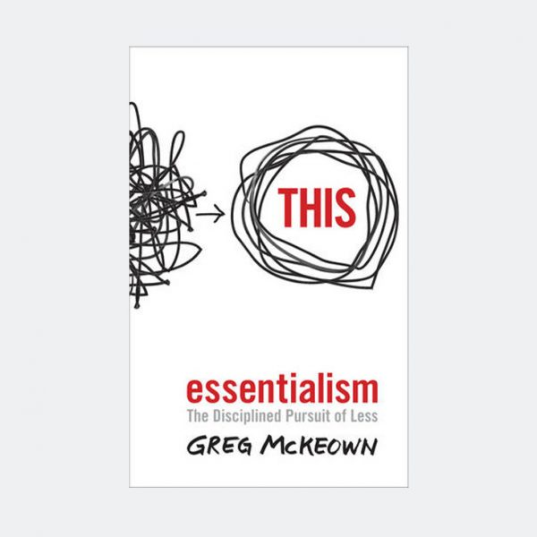
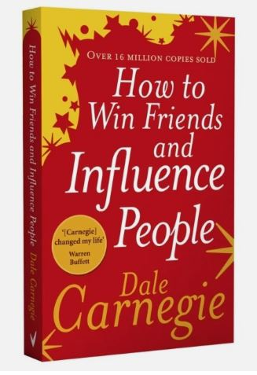
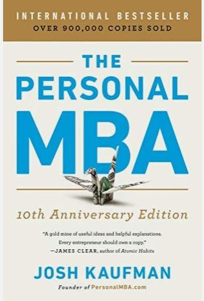
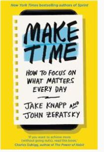

# Week 01 — Success Mindset (Mindset OS)

Part of the DevOps Micro Internship (DMI) Cohort 3 with Agentic AI

---

## Purpose (Read This First)

This week is not motivation homework.

This is you building your **Mindset OS** — the system you will use for the next 5 months (and honestly, for years).

### Expectations

* Be honest.
* Be specific.
* Be practical.
* Write like an adult professional: clear sentences, no one-liners.

You will reuse this in later weeks. So do it properly once.

---

# Assignment 1. What is something you believe to be true that most people around you would disagree with?

### Rules

* No "safe" answers.
* Must be your real belief (not copied from internet).
* Minimum 50 words.

**Hint:** What do you believe about career, money, learning, discipline, relationships, health, success, life, tech industry, etc. that most people don't agree with?

## Answer

One thing I believe that many people around me disagree with is that changing careers is not a failure. I have studied engineering and IT and have also worked in different jobs while building my career. I believe every experience teaches valuable skills. Success comes from continuously learning and adapting, not from staying on one fixed career path.

---

# Assignment 2. What are the top 3 objective truths you discovered through experimentation and results?

### Definition

Objective truths do not depend on opinions. They hold true regardless of how people feel.

Write each truth in this format:

**Truth:** (1 sentence)

**Evidence from my life:** (2–4 lines: what you tried + what happened)

---

## Truth #1

### Truth

Consistent effort produces better results than working only when motivated.

### Evidence from my life

I completed multiple engineering degrees while working part-time in different jobs. By studying regularly and managing my time, I successfully graduated and gained valuable work experience.

---

## Truth #2

Practical experience improves skills faster than only studying theory.

### Evidence from my life

I worked in engineering, IT, cleaning, and hospitality roles. Each job taught me new skills that I could not have learned from books alone.

---

## Truth #3

### Truth

Learning new skills increases career opportunities.

### Evidence from my life

I learned programming, data analysis, and automation in addition to my engineering background. These skills allowed me to apply for a wider range of jobs and research positions.

---

# Assignment 3. What does your 2.0 version look like?

### Instructions

Write as if a journalist is writing about you **3 to 7 years from now** (not 20 years).

**Minimum 300 words.**

### Rules

* Write in past tense, like it already happened.
* Don't use "likes to / wants to / hopes to."
* Use specifics:

  * built
  * shipped
  * led
  * published
  * earned
  * relocated
  * contributed
* Include skills proof:

  * projects
  * portfolios
  * GitHub
  * blogs
  * certifications
  * job role
  * leadership
  * community contribution
* Add 1–3 images if you can (optional but powerful).

### Publish It Publicly On Any ONE

* LinkedIn
* Medium
* WordPress
* Blogspot
* Personal blog
* Portfolio page

Include this line:

> **P.S. This post is part of the DevOps Micro Internship (DMI) with Agentic AI — Cohort 3 — by [Pravin Mishra](https://www.linkedin.com/in/pravin-mishra-aws-trainer/). My graded progress is public: https://dmi.pravinmishra.com/s/YOUR-GITHUB-USERNAME.html · Start your DevOps journey: https://dmi.pravinmishra.com/?utm_source=student&utm_medium=ps-blog&utm_campaign=cohort3**

## Your Article

What does my 2.0 version look like?

Supun Rankothge: From Continuous Learning to Technology Leadership
Over the past several years, Supun Rankothge established himself as a skilled automation and AI engineer in Finland by combining his engineering background with practical industry experience. He built intelligent software solutions that improved industrial processes, reduced manual work, and increased operational efficiency. His work demonstrated that continuous learning and persistence could create opportunities across multiple industries.
Supun earned a full-time engineering role where he led automation and data-driven projects using Python, machine learning, cloud technologies, and industrial automation tools. He shipped several successful software and process automation solutions that helped organizations improve productivity and reduce operational costs. His technical portfolio and GitHub repository showcased projects involving artificial intelligence, data analytics, IoT, and smart manufacturing systems.
In addition to his professional work, Supun published technical articles and project documentation that helped students and early-career engineers understand practical applications of AI and automation. He completed industry-recognized certifications in cloud computing, software development, and data engineering, strengthening his expertise and expanding his professional network.
His leadership extended beyond the workplace. He mentored junior engineers, participated in technology meetups, and contributed to open-source projects. He shared knowledge through workshops and online communities, encouraging others to develop practical engineering skills and embrace lifelong learning.
Supun also contributed to research by collaborating with universities and industry partners on projects related to artificial intelligence, digital transformation, and smart industrial systems. His research findings and technical contributions were presented at conferences and published in respected journals, further establishing his reputation in the engineering community.
By consistently building projects, publishing his work, contributing to the community, and expanding his technical expertise, Supun transformed his career into one defined by innovation, leadership, and measurable impact. His journey became an example of how determination, adaptability, and continuous skill development could lead to long-term success in the rapidly evolving technology industry.

**P.S. This post is a part of DevOps Micro Internship with Agentic AI Cohort-3 by [Pravin Mishra](https://lnkd.in/dkPeb7Nm). You can start your DevOps journey by joining this [Discord community](https://lnkd.in/d3sQDC3J) ( https://lnkd.in/d3sQDC3J )

### Public Link

Paste your link here:

https://www.linkedin.com/feed/update/urn:li:activity:7478878317400506368/

---

# Assignment 4. Have you ever cut corners (unethical / dishonest / shortcut behavior — not necessarily illegal)? If yes, how did it make you feel?

### Important

You don't need to write the full story.

Focus on the feeling:

* guilt
* fear
* shame
* stress
* regret
* numbness
* etc.

This is about self-awareness, not judgment.

### Answer Format

**Yes / No**

If Yes:

**What emotion did you feel?** (minimum 50–100 words)

## Answer

I felt guilty and uncomfortable. As a student, I have sometimes taken small shortcuts because of deadlines or pressure. Even though it helped me finish faster, I did not feel proud of it. I kept thinking that I should have done the work properly on my own. That experience taught me that honesty is more important than saving time. Since then, I have tried to manage my time better, learn from my mistakes, and complete my work with integrity.

---

# Assignment 5. What are 10 non-fiction books you plan to read in the next 1 year?

### Rules

* Mention **Title + Author**
* Any language allowed
* No fiction novels

### Tip

Choose books that improve:

* mindset
* communication
* productivity
* health
* money
* career
* leadership

## Book List

1. Clean Code – Robert C. Martin 

2. The DevOps Handbook – Gene Kim, Jez Humble, Patrick Debois & John Willis 

3. Designing Data-Intensive Applications – Martin Kleppmann 

4. The Linux Command Line – William Shotts 

5. Start with Why – Simon Sinek 

6. Essentialism: The Disciplined Pursuit of Less – Greg McKeown 

7. Rich Dad Poor Dad – Robert T. Kiyosaki 

8. How to Win Friends and Influence People – Dale Carnegie 

9. The Personal MBA – Josh Kaufman 

10. Make Time – Jake Knapp & John Zeratsky

---

# Assignment 6. What are the things you will measure regularly in your life and career?

### Rules

List topics only. No need to share numbers.

### Must Include

* Learning / skill
* Output / proof
* Health / energy
* Time / focus
* Money / finance (personal or business)

### Example

* Learning hours per week
* Deep work sessions per week
* Projects shipped / documented
* Steps / workouts
* Sleep hours
* Spending tracker

## My Metrics

* Hours spent learning DevOps, AI, and cloud technologies
* Hands-on projects completed in Python, Docker, Kubernetes, and AWS
* GitHub commits and portfolio updates
* Research papers, technical articles, or blogs published
* New professional certifications earned
* Physical exercise and daily walking
* Sleep quality and daily energy level
* Time spent on focused work instead of distractions
* Monthly savings and investment progress
* Professional network growth through LinkedIn, conferences, and technology communities

---

# Assignment 7. Brain Dump + 5-Month System Plan

## Step 1: Brain Dump (Private)

Do a brain dump of everything in your mind into a notebook.

Examples:

* Bills
* Tasks
* Worries
* Goals
* Pending messages
* Ideas
* Responsibilities

### Did You Do It?

**Yes / No**

Answer:

Yes, I completed a brain dump by writing down my tasks, career goals, learning plans, job applications, personal responsibilities, financial matters, and ideas for future projects. It helped me organize my thoughts and identify my priorities more clearly.

---

## Step 2: Your 5-Month Routine + Focus Blocks

Create a simple plan you can realistically follow for the next 5 months.

### Weekly Routine

Example:

* Mon–Thu: 60 min deep work
* Sat: DMI session
* Sun: Weekly review

#### My Weekly Routine

Monday: Complete DevOps assignments.
Tuesday: Practice DevOps labs.
Wednesday: Study for certifications.
Thursday: Work on projects and assignments.
Friday: Review topics and prepare for class.
Saturday: Attend the 8-hour DevOps class.
Sunday: Revise, update GitHub, and plan the next week.

---

### Focus Blocks

#### When Will You Do DMI Work? (Days + Time)

Focus Blocks (DMI Work)
Monday: 6:00 PM – 8:00 PM
Tuesday: 6:00 PM – 8:00 PM
Wednesday: 6:00 PM – 8:00 PM
Thursday: 6:00 PM – 8:00 PM
Friday: 6:00 PM – 7:30 PM
Saturday: 9:00 AM – 5:00 PM (DevOps class)
Sunday: 10:00 AM – 12:00 PM (Revision and weekly planning)

#### How Many Sessions Per Week?

7 sessions per week

---

### Distraction Rules

Examples:

* Phone rules
* Social media rules
* Environment setup

#### My Distraction Rules

Keep my phone on silent during study sessions.
Avoid social media until I finish my daily tasks.
Study in a quiet place with a clean desk.
Turn off unnecessary notifications on my laptop.
Focus on one task at a time.
Take a 10-minute break after every 2 hours of study.

---

# Reflection – Week 1

### Biggest insight I got about myself this week

I realized that I achieve more when I stay consistent and follow a clear plan.

### My biggest weakness/loop I noticed

I sometimes spend too much time thinking instead of starting my work.

### One system I will implement from this week (exact habit + time)

I will study DevOps every Monday to Friday from 6:00 PM to 8:00 PM without using my phone.

### LinkedIn Post

📘 Week 1 Reflection – My DevOps Learning Journey
This week reminded me that progress comes from consistency, not perfection.
Here are my key takeaways:
✅ Biggest insight: I achieve more when I stay consistent and follow a clear plan.
⚡ Biggest weakness: I sometimes spend too much time thinking before I start my work.
🎯 New habit: From this week onward, I will study DevOps every Monday to Friday from 6:00 PM to 8:00 PM without using my phone.
Small daily improvements can lead to big results over time. I'm excited to continue learning, building projects, and growing my skills in DevOps and cloud technologies.
#DevOps #ContinuousLearning #CareerGrowth #CloudComputing #AWS #Linux #Docker #LearningJourney
**P.S. This post is a part of DevOps Micro Internship with Agentic AI Cohort-3 by [Pravin Mishra](https://lnkd.in/dkPeb7Nm). You can start your DevOps journey by joining this [Discord community](https://lnkd.in/d3sQDC3J) ( https://lnkd.in/d3sQDC3J )

`https://www.linkedin.com/feed/update/urn:li:activity:7478899006819975168/

---

## 10. Proof of Work

- LinkedIn Post URL: **https://www.linkedin.com/feed/update/urn:li:activity:7478878317400506368/,https://www.linkedin.com/feed/update/urn:li:activity:7478899006819975168/**  
- Blog / Medium : **ADD LINK HERE**  

---

## 📌 About DMI & CloudAdvisory

DevOps Micro Internship (DMI) is a project-based DevOps program run by Pravin Mishra (The CloudAdvisory) focused on real-world execution, systems thinking, and career readiness.

It helps learners build strong DevOps foundations with hands-on experience.

## 📌 Resources

- 🌐 **DMI Official Website:** https://pravinmishra.com/dmi  
- 🎓 **DevOps for Beginners (Udemy):** https://www.udemy.com/course/devops-for-beginners-docker-k8s-cloud-cicd-4-projects/  
- 🎓 **Ultimate Agentic AI DevOps with Clude Code** https://www.udemy.com/course/ultimate-agentic-ai-devops-with-claude-code/?referralCode=448389767BC96284087B
- 🎓 **DevOps with Claude Code: Terraform, EKS, ArgoCD & Helm** https://www.udemy.com/course/devops-with-claude-code-terraform-eks-argocd-helm/?referralCode=1C5B734505D65A010FA3
- ▶️ **YouTube Playlist (DMI Cohort 3):** https://www.youtube.com/playlist?list=PLFeSNDtI4Cho  
- 🔗 **Pravin Mishra (LinkedIn):** https://www.linkedin.com/in/pravin-mishra-aws-trainer/  
- 🏢 **CloudAdvisory (LinkedIn):** https://www.linkedin.com/company/thecloudadvisory/

---

*This submission is part of DevOps Micro Internship (DMI) Cohort 3 — Agentic AI Track*