# Assignment 3 — Production Maintenance Drill (OPS Checklist)

Part of the DevOps Micro Internship (DMI) Cohort 3 with Agentic AI

---

## Purpose

In this assignment, you will treat your already deployed React application (on Ubuntu VM with Nginx) as a live production system. You will perform structured operational checks covering network validation, service health, log analysis, resource monitoring, configuration verification, and incident simulation with recovery — mirroring real on-call DevOps responsibilities.

---

# Task 1 — Server Access & Networking Validation

## Goal

Verify that the deployed React application is reachable from the browser and confirm basic network connectivity of the Ubuntu VM.

### Evidence

#### Screenshot 1 — Browser showing the React app with your Full Name visible on the UI

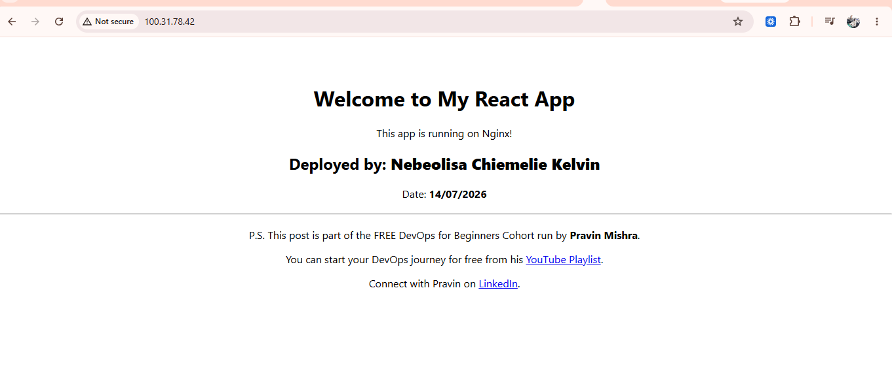

---

#### Screenshot 2 — Output of `ip a`

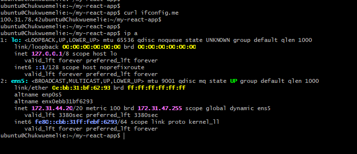

---

#### Screenshot 3 — Output of `sudo ss -tulpen`

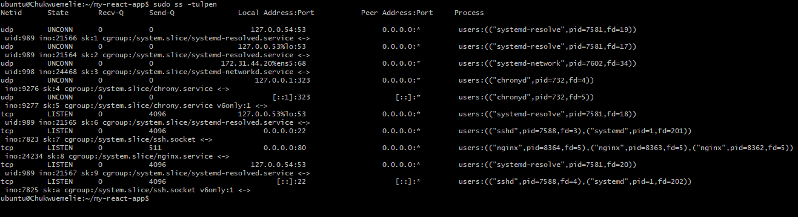

---

#### Screenshot 4 — Output of `sudo ufw status`

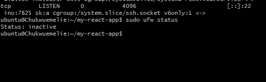

---

### Notes

Answer the following in your own words:

**1. What proves Nginx is listening on 0.0.0.0:80?**

Nginx is proven to be listening on 0.0.0.0:80 when a command such as sudo ss -tulnp or sudo netstat -tulnp shows Nginx bound to 0.0.0.0:80 in the LISTEN state. This means Nginx is accepting HTTP connections on port 80 from all network interfaces, allowing the web server to be reached by clients over the network

---

**2. What proves SSH is active on port 22?**

An open port 22 responding to a network connection request by returning an official SSH version string banner proves the SSH daemon is actively running, listening, and ready to authenticate
---

**3. Did you find any unexpected open ports? Explain briefly.**

After reviewing the list of open ports, I confirmed there were no unexpected services running. Only port 22 (SSH) and port 80 (Nginx) were active, which is exactly what I expected. This indicates that only the required services are exposed, reducing the server's attack surface and improving its overall security

---

# Task 2 — Service Health & Systemd Validation (Nginx)

## Goal

Verify that Nginx is properly installed, running, enabled at boot, and safely configured.

### Evidence

#### Screenshot 1 — Output of `systemctl status nginx --no-pager`

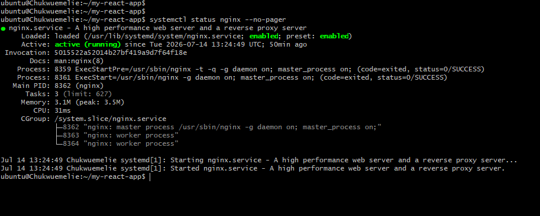

---

#### Screenshot 2 — Output of `sudo nginx -t`

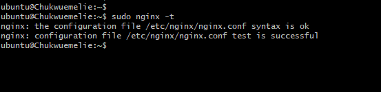

---

#### Screenshot 3 — Output of `sudo ss -lptn '( sport = :80 )'`

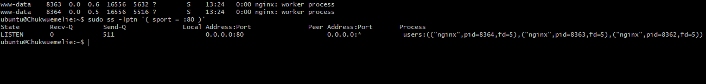

---

### Notes

Answer the following in your own words:

**1. What happens if Nginx fails to restart in production?**

If Nginx fails to restart the production environment we deployed React app will immediately become inaccessible to us, and we will likely see a "502 Bad Gateway" or "Connection Refused" error. Nginx acts as the front door. If it is down, it can no longer receive incoming web requests (on ports 80 or 443) and route them to the Node.js server or the static build files hosting your React frontend.Nginx is responsible for physically serving our compiled HTML, CSS, and JavaScript files (index.html, bundle.js) to the browser. If Nginx fails, the browser can't download these files, meaning the app cannot load at all.

---

**2. What's your basic rollback plan?**

My basic rollback plan is to restore the server to its last known working state if a deployment or configuration change causes issues. This would involve reverting the application files to the previous version, undoing any recent Nginx configuration changes if necessary, validating the configuration using sudo nginx -t, restarting the Nginx service, and verifying that the application is accessible again. Having a rollback plan minimizes downtime and ensures that users can continue accessing the application while the root cause of the issue is investigated and resolved
---

# Task 3 — Logs & Request Trace

## Goal

Verify real traffic flow and analyze logs to understand system behavior and errors.

### Evidence

#### Screenshot 1 — Output of `sudo tail -n 30 /var/log/nginx/access.log`

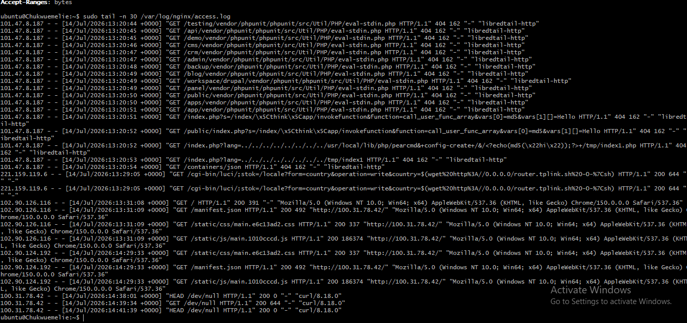

---

#### Screenshot 2 — Output of `sudo tail -n 30 /var/log/nginx/error.log`

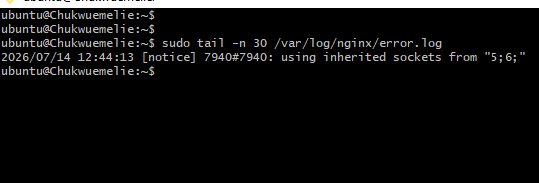

---

#### Screenshot 3 — Output of `sudo journalctl -u nginx --no-pager -n 50`

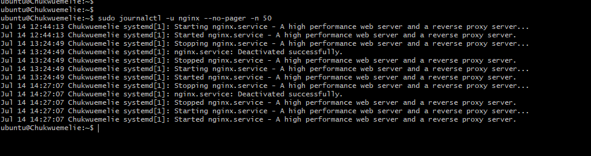

---

### Notes

Answer the following in your own words:

**1. Were there any errors in the logs?**

- If yes, mention 1–2 example error lines from the logs and explain what each one means in simple terms.
- If no, explain what it means if the error log is empty or shows no recent errors during your check.

No error logs

---

**2. If there were no errors, what does that indicate about the system?**

During my review, I did not find any recent errors in the Nginx error log. An empty or clean error log generally indicates that Nginx is operating normally and has not encountered issues such as failed requests, configuration problems, or service failures during the period being checked. While this does not guarantee the application is completely free of problems, it is a strong indication that the web server is functioning as expected and handling requests successfully.

---

**3. Based on the access logs, were your curl requests visible in the log entries? What does that prove about traffic flow?**

Yes. The curl requests were visible in the Nginx access logs. This proves that the requests successfully reached the Nginx web server, were processed correctly, and were recorded by the server. It also confirms that the network path, web server configuration, and logging system were all functioning properly, allowing incoming traffic to be received and tracked.

---

# Task 4 — System Resource Health Check (Capacity Red Flags)

## Goal

Assess server capacity and detect potential performance or failure risks.

### Evidence

#### Screenshot 1 — Output of `uptime`

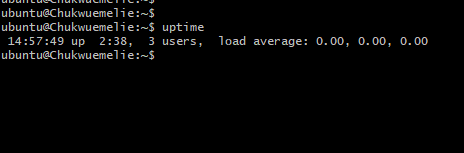

---

#### Screenshot 2 — Output of `free -h`

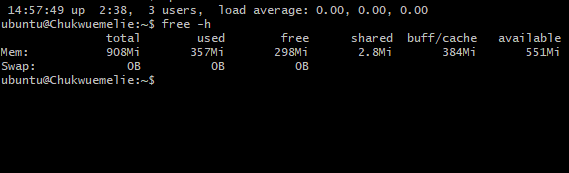

---

#### Screenshot 3 — Output of `df -h`

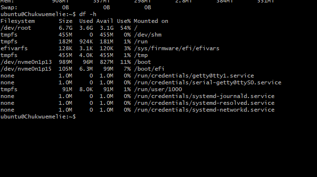

---

#### Screenshot 4 — Output of `sudo du -sh /var/* | sort -h`

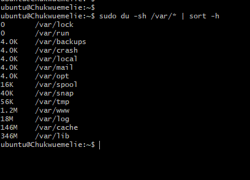

---

### Notes

Answer the following in your own words:

**1. Which resource looks most critical right now? (CPU/load, memory, or disk) Explain why.**

Based on my system checks, no resource appeared to be under critical pressure. CPU load was within a normal range, memory usage was sufficient with available free memory, and disk utilization showed adequate free space. If I had to prioritize one resource, I would monitor disk usage most closely because a full disk can prevent applications from writing logs, storing data, or operating correctly, potentially leading to service disruptions even when CPU and memory are healthy.

---

**2. What happens if disk becomes 100% full in a production server?**

If a production server's disk reaches 100% capacity, it can cause serious operational problems. Applications may fail to write logs, databases may stop accepting new data, temporary files cannot be created, and software updates or deployments may fail. In some cases, critical services like Nginx or other system processes may become unstable or stop functioning properly. This is why monitoring disk usage is an essential part of maintaining a healthy and reliable production environment.

---

# Task 5 — Configuration & Deployment Verification

## Goal

Ensure the correct React build is deployed and Nginx is serving it properly.

### Evidence

#### Screenshot 1 — Output of `ls -lah /var/www/html | head -n 20`

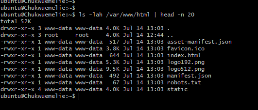

---

#### Screenshot 2 — Output of `grep -R "Deployed by" -n /var/www/html 2>/dev/null | head`

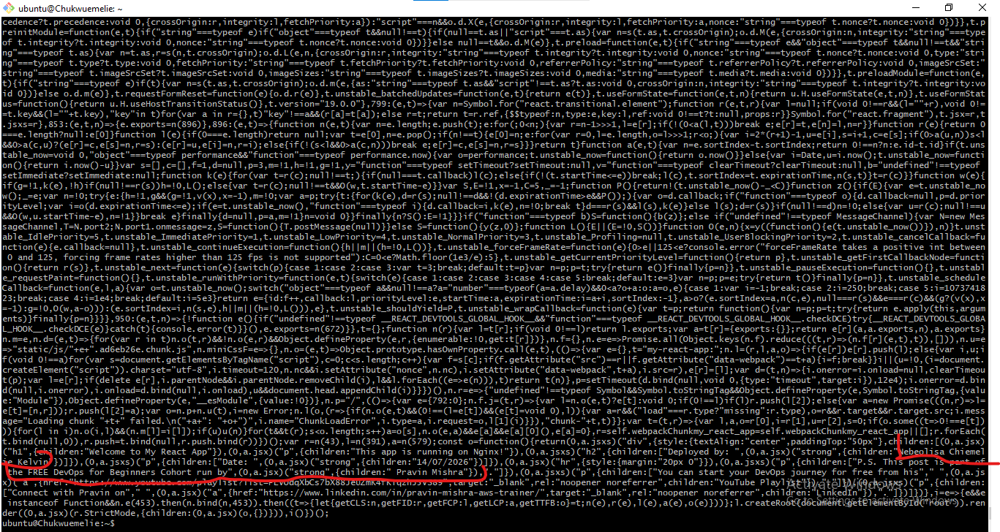

---

#### Screenshot 3 — Output of `grep -n "try_files" /etc/nginx/sites-available/default`

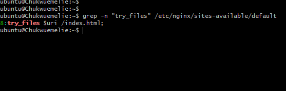

---

### Notes

Answer the following in your own words:

**1. How do you confirm that the correct version of the application is deployed?**

To confirm that the correct version of the application is deployed, I compare the deployed application with the expected version by checking its visible changes, such as the updated content, footer, or version-specific details in the browser. I also verify that the latest build files have been copied to the deployment directory (/var/www/html for Nginx) and confirm that the application loads correctly without errors. This ensures that the most recent build is the one being served to users.

---

# Task 6 — Nginx Configuration Failure Simulation

## Goal

Simulate a real-world Nginx misconfiguration and recover the service safely.

### Evidence

#### Screenshot 1 — Output of `sudo nginx -t` showing the syntax error (broken config)

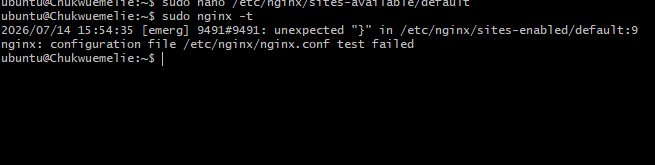

---

#### Screenshot 2 — Output of `sudo nginx -t` showing syntax ok (fixed config)

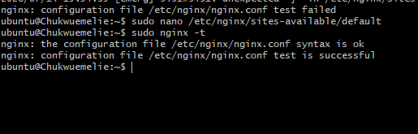

---

#### Screenshot 3 — Output of `curl -I http://<public-ip>` confirming recovery (200 OK)

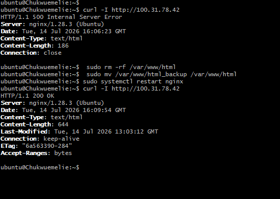

---

### Notes

Answer the following in your own words:

**1. What caused the configuration failure?**

The configuration failure was caused by an intentional syntax error in the Nginx configuration file. This prevented Nginx from validating the configuration successfully. Running sudo nginx -t identified the error, allowing me to locate the incorrect configuration, fix it, and verify that the configuration was valid before restarting the service. This exercise demonstrated the importance of testing configuration changes before applying them in a production environment.

---

**2. How did you fix the issue?**

I fixed the issue by first running sudo nginx -t to identify the exact configuration error. After locating the problem, I corrected the syntax in the Nginx configuration file and tested it again until the configuration was successful. Once the validation passed, I restarted the Nginx service and confirmed that the web application was accessible and functioning normally. This approach ensured the issue was resolved safely without introducing additional configuration errors.

---

**3. How can you avoid this kind of issue in real production systems?**

This kind of issue can be avoided by validating the Nginx configuration with sudo nginx -t before reloading or restarting the service. It is also important to review configuration changes carefully, maintain backups of working configuration files, and use version control to track modifications. In production environments, testing changes in a staging environment before applying them to live servers helps reduce the risk of downtime caused by configuration errors.

---

# Task 7 — Web Application Failure Simulation

## Goal

Simulate missing deployment content and recover the application safely.

### Evidence

#### Screenshot 1 — Output of `curl -I http://<public-ip>` showing failure (non-200 response)

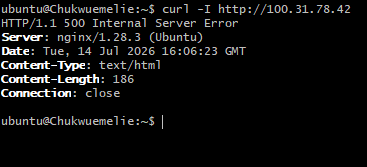

---

#### Screenshot 2 — Output of `curl -I http://<public-ip>` confirming recovery (200 OK)

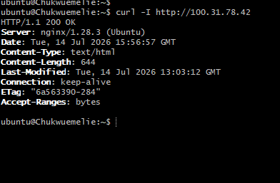

---

### Notes

Answer the following in your own words:

**1. What caused the application to break in this scenario?**

The application broke because the deployed application files were intentionally removed or became unavailable from the Nginx web root. As a result, Nginx could no longer find the files required to serve the website, causing the application to become inaccessible. This simulated a real-world deployment issue where application files are accidentally deleted, misplaced, or not deployed correctly

---

**2. How did you fix the issue and restore the application?**

I restored the application by redeploying the correct application files to the Nginx web root directory. After confirming that all required files were in the correct location, I verified the Nginx configuration, ensured the service was running properly, and tested the application in the browser to confirm it was accessible again. This process successfully restored the website to its expected working state.

---

**3. What steps would you take to prevent this kind of issue in real production systems?**

To prevent this type of issue in a production environment, I would use a structured deployment process with version control, maintain backups of previous application releases, and verify that all deployment files are present before going live. I would also implement automated deployment pipelines, perform deployment validation checks, and keep a rollback plan ready so the previous working version can be restored quickly if a deployment fails.

---

# Task 8 — Security & Reliability Review

## Goal

Review and reflect on the security and reliability practices applied during this assignment.

### Security & Reliability Notes

Answer the following in your own words:

**1. Why is SSH key-based authentication more secure than sharing passwords?**

SSH key-based authentication is more secure because it uses a pair of cryptographic keys instead of a password that can be guessed or stolen. The private key remains securely on the user's device, while the public key is stored on the server. This significantly reduces the risk of brute-force attacks, password theft, and unauthorized access, making it the preferred authentication method for production servers

---

**2. Why should only required ports be open on a production server?**

Only the required ports should be open on a production server to minimize its attack surface. Every open port represents a potential entry point that attackers can scan or exploit. By exposing only the services that are necessary, such as SSH for administration and HTTP or HTTPS for web traffic, the server becomes more secure and easier to manage.

---

**3. Why is it important for Nginx to be enabled on boot?**

Enabling Nginx on boot ensures that the web server starts automatically whenever the server is restarted or recovers from an unexpected shutdown. This helps maintain application availability without requiring manual intervention, reducing downtime and ensuring users can continue accessing the website or application after a reboot.

---

**4. What are the risks of sharing secrets, keys, or credentials publicly?**

Sharing secrets, API keys, SSH keys, or credentials publicly can lead to unauthorized access to servers, applications, or cloud resources. Attackers may use these credentials to steal sensitive data, modify systems, deploy malicious software, or incur unexpected cloud costs. Sensitive credentials should always be stored securely and never exposed in public repositories, screenshots, or shared documents

---

**5. Why should cloud resources be stopped or terminated when they are no longer needed?**

Cloud resources should be stopped or terminated when they are no longer needed to avoid unnecessary costs and reduce security risks. Unused virtual machines, storage, or services continue to consume resources and may remain vulnerable if left running. Properly cleaning up unused resources helps control expenses, improves resource management, and reduces the overall attack surface of the cloud environment

---

# LinkedIn Post (Required)

## Evidence

#### LinkedIn Post URL

https://www.linkedin.com/posts/chukwuemelie-kelvin-nebeolisa_this-week-during-my-devops-internship-one-ugcPost-7483188331170693120-i4qb/?

`Add your URL here`

---

#### Screenshot — Published LinkedIn post

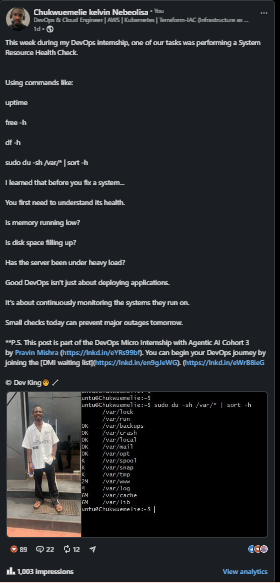

---

# Submission Instructions

- Add all required screenshots in your submission
- Full name must be visible in required screenshots
- Do not expose sensitive information (keys, passwords, account IDs)

---

# Completion Checklist

- [ ] Task 1: Screenshots (browser, ip a, ss -tulpen, ufw status) + Notes answered
- [ ] Task 2: Screenshots (nginx status, nginx -t, ss port 80) + Notes answered
- [ ] Task 3: Screenshots (access log, error log, journalctl) + Notes answered
- [ ] Task 4: Screenshots (uptime, free -h, df -h, du -sh) + Notes answered
- [ ] Task 5: Screenshots (ls html, grep deployed by, grep try_files) + Notes answered
- [ ] Task 6: Screenshots (nginx -t fail, nginx -t pass, curl recovery) + Notes answered
- [ ] Task 7: Screenshots (curl failure, curl recovery) + Notes answered
- [ ] Task 8: Security & Reliability Notes answered
- [ ] LinkedIn post published and URL submitted
- [ ] Full Name visible in all required screenshots
- [ ] No sensitive data exposed

---

## 📌 About DMI & CloudAdvisory

DevOps Micro Internship (DMI) is a project-based DevOps program run by Pravin Mishra (The CloudAdvisory) focused on real-world execution, systems thinking, and career readiness.

It helps learners build strong DevOps foundations with hands-on experience.

---

## 📌 Resources

- 🌐 DMI Official Website: https://pravinmishra.com/dmi  
- 🎓 DevOps for Beginners (Udemy): https://www.udemy.com/course/devops-for-beginners-docker-k8s-cloud-cicd-4-projects/  
- 🎓 Agentic AI DevOps with Claude Code: https://www.udemy.com/course/ultimate-agentic-ai-devops-with-claude-code/  
- 🎓 DevOps with Claude Code: Terraform, EKS, ArgoCD & Helm: https://www.udemy.com/course/devops-with-claude-code-terraform-eks-argocd-helm/  
- ▶️ YouTube Playlist: https://www.youtube.com/playlist?list=PLFeSNDtI4Cho  
- 🔗 Pravin Mishra (LinkedIn): https://www.linkedin.com/in/pravin-mishra-aws-trainer/  
- 🏢 CloudAdvisory (LinkedIn): https://www.linkedin.com/company/thecloudadvisory/

---

*This submission is part of DevOps Micro Internship (DMI) Cohort 3 — Agentic AI Track.*