# Assignment 5 — Bash Script Automation Drill (OPS Checklist)

Part of the DevOps Micro Internship (DMI) Cohort 3 with Agentic AI

---

## Purpose

In this assignment, you will practice Bash scripting by building a series of small automation scripts covering environment setup, variables, arrays, loops, file conditionals, if-else logic, and functions. These scripts form the foundation of real-world Linux automation used in DevOps, cloud, and production support environments.

---

# Task 1 — Bash Environment & Workspace Setup

## Goal

Verify that Bash is available on your system and create a clean workspace for this assignment.

### Evidence

#### Screenshot 1 — Output of `echo $SHELL` and `bash --version`

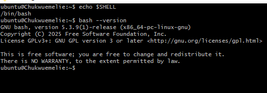

---

#### Screenshot 2 — Output of `pwd` and `ls -lah` showing the scripts directory

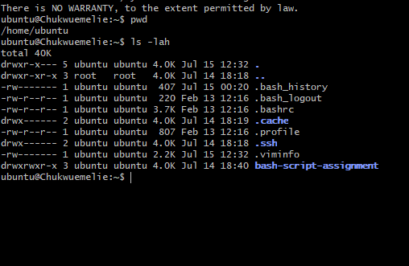

---

### Notes

Answer the following in your own words:

**1. What is Bash?**

Bash is a Unix/Linux command-line interpreter and scripting language that allows users to interact with the operating system. It enables users to execute commands, automate repetitive tasks, manage files, control system processes, and write scripts that simplify system administration and DevOps operations. Bash is widely used because it is powerful, flexible, and available by default on most Linux distributions.

---

**2. What is the difference between shell and Bash?**

A shell is a general program that provides an interface between the user and the operating system, allowing commands to be executed. Bash is a specific type of shell and one of the most popular shell implementations. In other words, every Bash is a shell, but not every shell is Bash. Other shell types include sh (Bourne Shell), zsh (Z Shell), and ksh (Korn Shell), each with its own features and capabilities.

---

**3. Why is it important to confirm the Bash version before writing scripts?**

Confirming the Bash version is important because different versions support different features and syntax. A script written using features available in a newer Bash version may fail on an older version that does not support them. Checking the version beforehand helps ensure compatibility, prevents unexpected errors, and allows scripts to run reliably across different Linux environments.

---

# Task 2 — Your First Bash Script

## Goal

Create your first Bash script, make it executable, and run it from the terminal.

### Evidence

#### Screenshot 1 — Content of `first-script.sh`

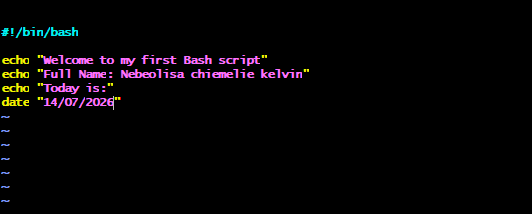

---

#### Screenshot 2 — Output of `./first-script.sh`

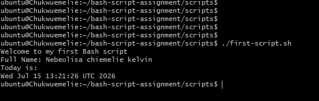

---

#### Screenshot 3 — Output of `ls -l first-script.sh` showing executable permission

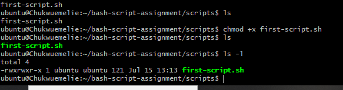

---

### Notes

Answer the following in your own words:

**1. What is the purpose of `#!/bin/bash`?**

The #!/bin/bash line tells the operating system which interpreter should be used to execute the script. In this case, it instructs the system to use the Bash shell. Including the shebang ensures the script runs with the correct interpreter, regardless of the user's default shell, making the script more reliable and portable across Linux systems.

---

**2. Why do we use `chmod +x` before running a script?**

The chmod +x command is used to make a script executable. By default, a newly created script is treated as a regular text file and cannot be executed directly. Adding the execute (+x) permission allows the operating system to recognize it as a program that can be run, enabling commands such as ./script.sh to execute successfully

---

**3. What is the difference between running a script using `./script.sh` and `bash script.sh`?**

When you run a script using ./script.sh, the operating system executes the script directly, provided it has execute permission and contains a valid shebang (such as #!/bin/bash) that specifies which interpreter to use. In contrast, running bash script.sh explicitly starts the Bash interpreter and passes the script to it, so the script can run even if it does not have execute permission. This method ignores the execute bit but still requires that the script be readable

---

# Task 3 — Variables: User Information Script

## Goal

Use variables to store and display user-related information.

### Evidence

#### Screenshot 1 — Content of `user-info.sh`

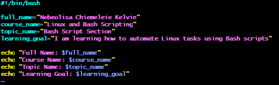

---

#### Screenshot 2 — Output of `./user-info.sh`

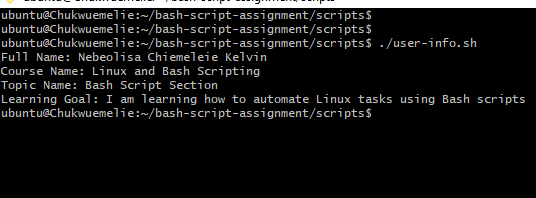

---

### Notes

Answer the following in your own words:

**1. What is a variable in Bash?**

A variable in Bash is a named storage location used to hold data such as text, numbers, file paths, or command output. Variables make scripts more flexible and reusable because values can be stored once and referenced multiple times throughout the script instead of being hardcoded. This simplifies maintenance and allows the same script to work with different inputs

---

**2. Why should we avoid spaces around the `=` sign when creating variables?**

Spaces should not be placed around the = sign because Bash interprets them differently. Writing name=value correctly assigns a value to the variable, whereas writing name = value causes Bash to treat name, =, and value as separate commands or arguments, resulting in an error. Following the correct syntax ensures that variables are assigned and used properly.

---

**3. How do you access the value stored inside a Bash variable?**

The value stored in a Bash variable is accessed by placing a dollar sign ($) before the variable name. For example, if a variable is created as name="chukwuemelie", its value can be displayed using echo $name. The dollar sign tells Bash to substitute the variable name with the value it contains, allowing it to be used in commands, conditions, and scripts.

---

# Task 4 — Arrays & Loops: Tools Checklist Script

## Goal

Use arrays and loops to print a checklist of tools used in Bash scripting.

### Evidence

#### Screenshot 1 — Content of `tools-checklist.sh`

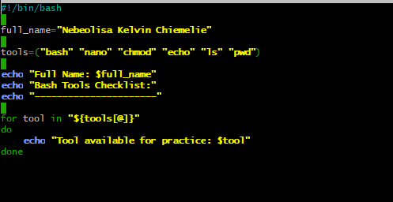

---

#### Screenshot 2 — Output of `./tools-checklist.sh`

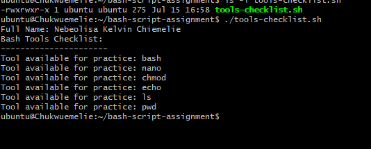

---

### Notes

Answer the following in your own words:

**1. What is an array in Bash?**

An array in Bash is a data structure that allows multiple values to be stored under a single variable name. Each value is assigned an index, making it easy to organize and access related pieces of data. Arrays are commonly used to store lists such as filenames, usernames, packages, or tools that need to be processed within a script.

---

**2. Why are arrays useful in scripts?**

Arrays are useful because they allow scripts to manage multiple related values without creating separate variables for each one. This makes scripts more organized, scalable, and easier to maintain. They are especially helpful when performing repetitive operations, such as looping through a list of files, commands, or software packages.

---

**3. What does `"${tools[@]}"` mean?**

The expression "${tools[@]}" represents all the elements stored in the tools array. The @ symbol tells Bash to expand every item in the array, while the double quotes ensure that each element is treated as a separate value, even if it contains spaces. This syntax is commonly used when iterating through arrays with a loop.

---

**4. What is the purpose of the `for` loop in this script?**

The purpose of the for loop is to execute the same block of code repeatedly for each element in an array or list. Instead of writing the same command multiple times, the loop processes each item one by one automatically. This improves efficiency, reduces code duplication, and makes Bash scripts easier to read, modify, and maintain.

---

# Task 5 — Loops: Number Counter Script

## Goal

Use loops to repeat a task multiple times.

### Evidence

#### Screenshot 1 — Content of `counter.sh`

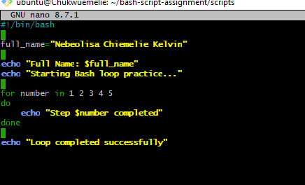

---

#### Screenshot 2 — Output of `./counter.sh`

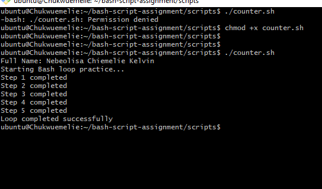

---

### Notes

Answer the following in your own words:

**1. What is a loop?**

A loop is a programming structure that repeatedly executes a block of code until a specified condition is met or until all items in a list have been processed. In Bash scripting, loops help automate repetitive tasks, making scripts more efficient and reducing the need to write the same commands multiple times.

---

**2. Why do we use loops in Bash scripting?**

Loops are used in Bash scripting to automate repetitive operations. They allow the same set of commands to be executed multiple times without duplicating code, making scripts shorter, easier to maintain, and more efficient. Loops are commonly used for processing files, checking system resources, installing packages, and iterating through arrays or lists.

---

**3. How many times did the loop run in your script?**

The loop ran five times because it was designed to count from 1 to 5. During each iteration, the loop executed the specified commands once before moving to the next number. This demonstrated how Bash loops repeatedly perform a task until the defined range is completed.

---

**4. What would you change if you wanted the loop to run 10 times?**

To make the loop run 10 times, I would modify the loop's range or condition from 1–5 to 1–10. For example, if the script used for i in {1..5}, I would change it to for i in {1..10}. This adjustment would cause the loop to execute ten iterations instead of five while keeping the rest of the script unchanged.

---

# Task 6 — Files & Conditionals: File Validation Script

## Goal

Use file checks and conditionals to verify whether files and directories exist.

### Evidence

#### Screenshot 1 — Output of `ls -lah ../test-folder`

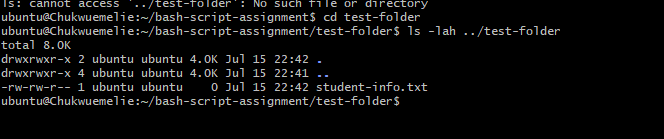

---

#### Screenshot 2 — Content of `file-check.sh`

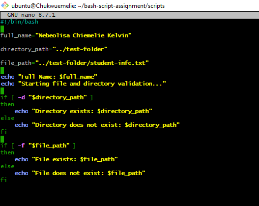

---

#### Screenshot 3 — Output of `./file-check.sh`

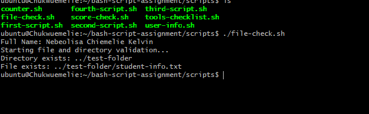

---

### Notes

Answer the following in your own words:

**1. What does `-d` check in Bash?**

The -d test operator checks whether a specified path exists and is a directory. It returns true if the directory is present and false if it does not exist or if the path points to something other than a directory. This is commonly used in Bash scripts to verify that required directories exist before performing operations such as creating, reading, or writing files.

---

**2. What does `-f` check in Bash?**

The -f test operator checks whether a specified path exists and is a regular file. It returns true only if the file exists and is not a directory, symbolic link, or special device file. This allows Bash scripts to safely verify the presence of required files before attempting to read, modify, or execute them.

---

**3. Why should file and directory paths be stored in variables?**

Storing file and directory paths in variables makes Bash scripts easier to read, maintain, and update. If a path changes, it only needs to be modified in one place instead of throughout the entire script. Using variables also reduces the risk of typing errors, improves code reusability, and makes scripts more flexible for different environments

---

**4. What happens if the file does not exist?**

If the file does not exist, the -f test evaluates to false, causing the script to execute the alternative logic defined in the else block or another error-handling section. This prevents the script from attempting to access a missing file, reducing the likelihood of runtime errors and allowing it to handle the situation gracefully

---

# Task 7 — Conditionals: Pass or Retry Script

## Goal

Use if-else conditionals to make decisions based on a variable value.

### Evidence

#### Screenshot 1 — Content of `score-check.sh` with `score=85`

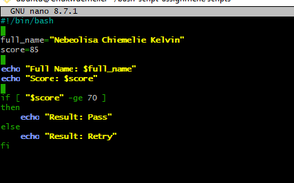

---

#### Screenshot 2 — Output showing `Result: Pass`

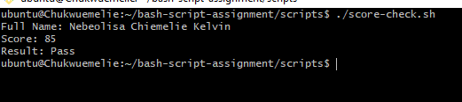

---

#### Screenshot 3 — Content of `score-check.sh` with `score=55`

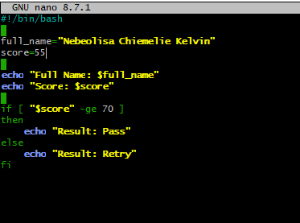

---

#### Screenshot 4 — Output showing `Result: Retry`

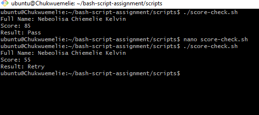

---

### Notes

Answer the following in your own words:

**1. What is the purpose of if-else in Bash?**

The if-else statement is used to make decisions in a Bash script based on whether a condition is true or false. If the specified condition is met, the commands inside the if block are executed. Otherwise, the commands in the else block run instead. This allows scripts to respond differently depending on the situation, making them more intelligent and adaptable.

---

**2. What does `-ge` mean?**

The -ge operator stands for "greater than or equal to" in Bash. It is used to compare two integer values within a conditional statement. If the first number is greater than or equal to the second number, the condition evaluates to true; otherwise, it evaluates to false. This operator is commonly used to make decisions based on numerical values, such as scores, counts, or resource usage.

---

**3. Why should conditions be tested with different values?**

Conditions should be tested with different values to ensure that every possible outcome of the script works correctly. Testing both true and false cases helps identify logic errors, confirms that the correct branch of the if-else statement executes, and improves the reliability of the script before it is used in a real environment.

---

**4. How can conditionals help in automation scripts?**

Conditionals make automation scripts more flexible by allowing them to make decisions based on the current state of the system. For example, a script can check whether a file exists, whether a service is running, or whether disk usage exceeds a threshold before deciding what action to take. This enables scripts to handle different situations automatically, reducing manual intervention and improving reliability.

---

# Task 8 — Functions: Final Bash Automation Script

## Goal

Create a final Bash script using functions to organize reusable code.

### Evidence

#### Screenshot 1 — Content of `final-automation.sh`

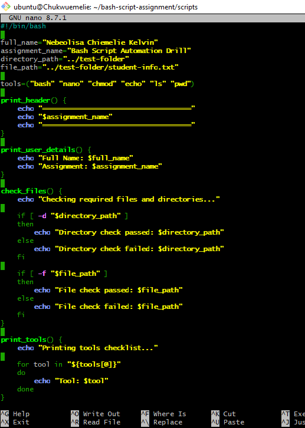

---

#### Screenshot 2 — Output of `./final-automation.sh`

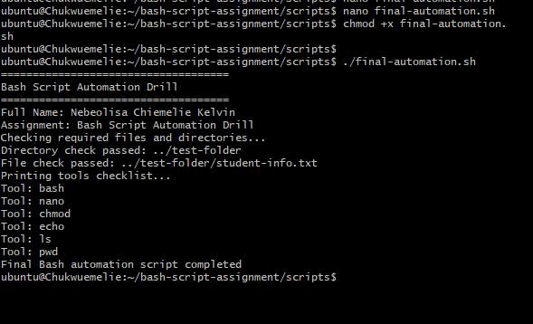

---

#### Screenshot 3 — Output of `ls -lah` showing all created scripts

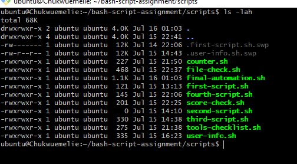

---

### Notes

Answer the following in your own words:

**1. What is a function in Bash?**

A function in Bash is a reusable block of commands grouped under a single name. Instead of writing the same code multiple times, the function can be called whenever needed. This makes scripts more organized, easier to read, and simpler to maintain, especially as they grow in size and complexity.

---

**2. Why are functions useful in scripts?**

Functions are useful because they promote code reusability and reduce duplication. They allow related commands to be grouped together, making scripts modular and easier to understand. If changes are needed, the function only has to be updated in one place, improving maintainability and reducing the chance of errors.

---

**3. Which functions did you create in this script?**

In my final Bash automation script, I created functions to organize different tasks into reusable sections. These included functions for displaying user information, checking required tools, validating files, evaluating conditions, and presenting the final automation results. By separating each task into its own function, the script became more structured, readable, and easier to troubleshoot

---

**4. How does this final script combine variables, arrays, loops, conditionals, files, and functions?**

The final Bash automation script combines multiple Bash concepts into a single workflow. Variables store important values such as user information and file paths, while arrays hold collections of related items like tools to be checked. Loops iterate through these arrays to perform repetitive tasks efficiently. Conditionals (if-else) evaluate different scenarios, such as whether a file exists or whether a condition has been met, allowing the script to make decisions automatically. File checks ensure required resources are available before proceeding, and functions organize all these operations into reusable, well-structured blocks. Together, these components create a practical automation script that is easier to maintain, reuse, and extend for real-world system administration and DevOps tasks.

---

# LinkedIn Post (Required)

## Evidence

#### LinkedIn Post URL

https://www.linkedin.com/posts/chukwuemelie-kelvin-nebeolisa_assignment-8-bash-scripting-i-used-to-activity-7483385165348691968-dpwk?
`Add your URL here`

---

#### Screenshot — Published LinkedIn post

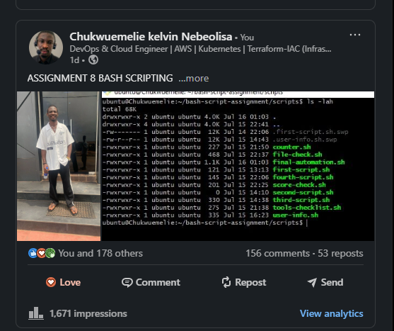

---

# Submission Instructions

- Add all required screenshots in your submission
- Full name must be visible in required screenshots
- All script files must be created and run successfully
- Required notes must be answered clearly for every task
- Do not expose sensitive information (keys, passwords, credentials)

---

# Completion Checklist

- [ ] Task 1: Environment setup verified, workspace created (Screenshots 1–2, Notes answered)
- [ ] Task 2: First script created, executed, permissions verified (Screenshots 1–3, Notes answered)
- [ ] Task 3: Variables script created and run (Screenshots 1–2, Notes answered)
- [ ] Task 4: Arrays and loops script created and run (Screenshots 1–2, Notes answered)
- [ ] Task 5: Counter loop script created and run (Screenshots 1–2, Notes answered)
- [ ] Task 6: File validation script created and run (Screenshots 1–3, Notes answered)
- [ ] Task 7: Pass/Retry conditional script tested with both values (Screenshots 1–4, Notes answered)
- [ ] Task 8: Final automation script created and run (Screenshots 1–3, Notes answered)
- [ ] All scripts run without errors
- [ ] Full Name visible in all required screenshots
- [ ] LinkedIn post published and URL submitted
- [ ] No sensitive data exposed

---

## 📌 About DMI & CloudAdvisory

DevOps Micro Internship (DMI) is a project-based DevOps program run by Pravin Mishra (The CloudAdvisory) focused on real-world execution, systems thinking, and career readiness.

It helps learners build strong DevOps foundations with hands-on experience.

---

## 📌 Resources

- 🌐 DMI Official Website: https://pravinmishra.com/dmi  
- 🎓 DevOps for Beginners (Udemy): https://www.udemy.com/course/devops-for-beginners-docker-k8s-cloud-cicd-4-projects/  
- 🎓 Agentic AI DevOps with Claude Code: https://www.udemy.com/course/ultimate-agentic-ai-devops-with-claude-code/  
- 🎓 DevOps with Claude Code: Terraform, EKS, ArgoCD & Helm: https://www.udemy.com/course/devops-with-claude-code-terraform-eks-argocd-helm/  
- ▶️ YouTube Playlist: https://www.youtube.com/playlist?list=PLFeSNDtI4Cho  
- 🔗 Pravin Mishra (LinkedIn): https://www.linkedin.com/in/pravin-mishra-aws-trainer/  
- 🏢 CloudAdvisory (LinkedIn): https://www.linkedin.com/company/thecloudadvisory/

---

*This submission is part of DevOps Micro Internship (DMI) Cohort 3 — Agentic AI Track.*